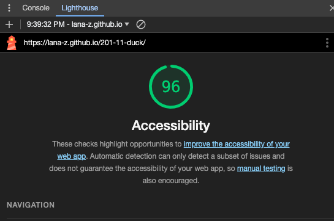

# LAB 201-11-duck

## Odd duck products

This is the Odd Duck Products lab, class 11, November 6, 2023.

### Author: Lana Zumbrunn

### Links and Resources

* John's demo
* Code review 

### Lighthouse Accessibility Report Score

### Reflections and Comments
* Understand in theory more of whats happening here than I did on salmon cookies. 
* Still having trouble with some of the js and chatgpt is suggesting more comprehensive changes, so I am calling it a night.
* I put in a TA help reequest in remo but by the time I was ready for TA help it was too late/ no more TAs were there. 

* TUESDAY: 
* Fixed functionality and broken image
* Now showing results
* Changed clicks to 25 🙂

* Lab 12: 
* Prevented duplicates in next round of images 
* Getting this error on my chart : chart.min.js:13 Failed to create chart: can't acquire context from the given item
* Think it has to do with the way I have my chart config set up. Will see if I can fix tomorrow! 

* WEDNESDAY: 
* Fixed the chart display by changing to canvas tag and fixed array problems. 
* Need to style the chart. 